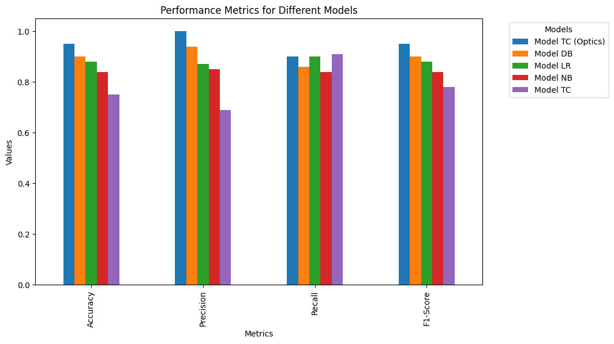
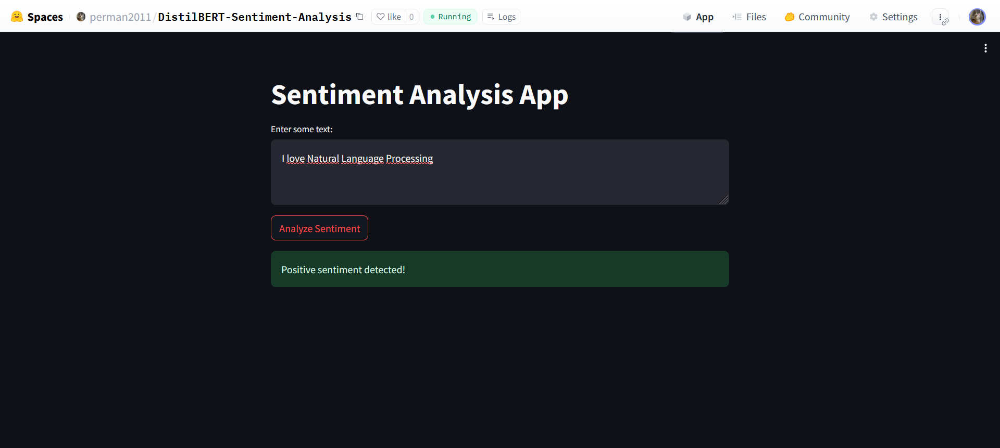

# Amazon Reviews Sentiment Analysis
## Unveiling Sentiments with Machine Learning and Deep Learning
Welcome to the fascinating world of sentiment analysis, where the dynamic landscape of Amazon product reviews unfolds through a synergy of classical and cutting-edge techniques. In this exploration, we embark on a journey that 🌐✨**extends beyond traditional approaches like Naive Bayes and Maximum Entropy, venturing into the transformative realm of transformer models, specifically DistilBERT**🌐✨. 🚀 🌟**Here, I introduce a novel paradigm—integrating optics clustering with a transformer encoder—to boost sentiment classification**🌟 This innovative fusion promises to elevate our understanding of consumer sentiments encoded within Amazon reviews.

To enhance robustness, **we implement a handling mechanism for mislabeled samples, drawing inspiration from the principles of k-fold cross-validation**. 🔄 Additionally, stay tuned for an engaging demo where we showcase the practical application of these methodologies on real Amazon product reviews. 🌟 This demo will provide a hands-on experience, allowing you to witness the power of our approach in action. Join us as we unravel the complex threads of sentiment woven into the fabric of digital feedback. 🌐✨

## Experiment Results

Curious about the outcomes of our experiment on the [Amazon Review dataset]((https://www.kaggle.com/datasets/bittlingmayer/amazonreviews))? Let's dive into the results:

The visual representation above encapsulates the performance metrics of various models, including accuracy, precision, recall, and F1-score. Each model, such as Model TC (Optics), Model DB, Model LR, Model NB, and Model TC, has undergone rigorous evaluation to assess its effectiveness in decoding sentiment from Amazon product reviews.

Based on the plot, it's amazing to see that 🔥🔥**just a simple transformer encoder with a very old-fashioned clustering method, Model_TC(Optics), can outperform any pre-trained model on the Amazon sentiment analysis dataset**🔥🔥. This highlights the power of thoughtful integration of classical techniques with modern approaches, unlocking exceptional performance in sentiment classification.

Stay tuned for a detailed analysis of these results and insights gained from our experiment! 📊🔍

## For Readers

The Vietnamese version of the project is available for exploration [here](./Readings/Documents/NLP%20Docs.pdf). The English version is currently in progress, and we're excited to share it with you soon! 🚀

## Application

In addition to our project exploration, we are thrilled to offer a live demo hosted on Hugging Face Spaces. 🚀

### Live Demo

Explore our sentiment analysis in action through our interactive demo. Witness firsthand how our models, including DistilBERT, decode sentiments from Amazon product reviews. Click [here](https://huggingface.co/spaces/perman2011/DistilBERT-Sentiment-Analysis) to access the demo on Hugging Face Spaces.

### Demo Preview

Curious about how the demo works? Take a sneak peek below:

This interactive demonstration showcases the power of our sentiment analysis approach. Feel free to interact with the demo, providing a hands-on experience of our models in action.

Give it a try and share your thoughts with us! 🌐✨

## Further

For further discussion, inquiries, or collaboration opportunities, feel free to contact me via email: [tommyquanglowkey2011@gmail.com](mailto:tommyquanglowkey2011@gmail.com). I'm excited to connect and explore potential avenues together! 🥇😆❤️

Additionally, your feedback is invaluable to us. If you have suggestions, questions, or insights, don't hesitate to reach out. Let's continue the conversation! 📧🌐✨
